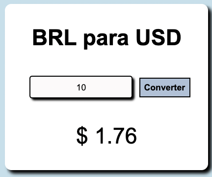
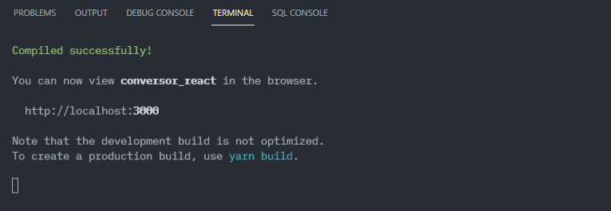

# Conversor React.JS

<p>Esse Conversor de moedas foi escrito em React.JS com *auxílio* (não cópia) do   Programador Br">vídeo</a> de React.JS do Programador BR. A obtenção dos valores das moedas atuais foi feita através da API Free.Currency disponibilizada <a href="https://free.currencyconverterapi.com/" alt="Link da API Free.Converter">aqui</a>.
</p><h3><a href="https://pt-br.reactjs.org/">🔗 React</a></h3><p >🚀 lib para construir interfaces do usuário com componentes reutilizáveis.</p>


<h2> Status do Projeto</h2>
<h4> React Select 🚀 Finzalizado  👍 </h4>
<h2>Demonstração</h2>


<h2>Como usar</h2>

 <p>Estando no com a aplicação aberta em seu navegador, será apresentado alguns Cards. Esses cards contem um campo de input onde só é permitido valores númericos e é requisitado a entrada de dados da parte do usuário para a exibição do valor convertido logo abaixo da caisa de input.</p>
 
 <p>A aplicação contém diferentes cards para a conversão poder ser feita em difenretes moedas do mundo, sendo elas BRL USD CAD JPY e EUR.</p>

 <h2> Pré-requisitos e como rodar a aplicação/testes </h2>

<p>Para seguir os passos a seguir é necessário que você tenha instalado em sua máquina o <a href="https://nodejs.org/en/" alt="Link do Node.js">node.js</a>, <a href="https://git-scm.com/downloads" alt="Link do Git">git</a>,<a href="https://code.visualstudio.com/download" alt="Link do Visual Studio Code">Visual Studio Code </a> ou outro editor de preferência </p>

 <p>Para rodar a aplicação na sua máquina primeiro clone o projeto para sua áreia de trabalho. para isso entre no terminal com as teclas W + R e digite cmd</p>

 <p>Dentro do cmd entre na sua área de trabalho ou em uma pasta de sua preferencia. Para isso use o comando cd + caminho da pasta que quer entrar, exemplo:</p>

```bash
   cd desktop/clone_conversor_app
```

<p>Estando dentro da pasta rode o comando a seguir para inicializar o git na sua pasta e poder baixar os arquivos:</p>

```bash
   git init
```

<p>Em seguida use: </p>

```bash
   git clone https://github.com/VictorSilva15/Conversor_React.git
```

<p>Esse comando irá iniciar a clonagem do projeto linkado nesse repositório para dentro da pasta que você criou em sua máquina.</p>

<p>Agora é abrir a pasta no seu editor de preferencia como Visual Studio Code, ou Sublime Text. Se você tiver instalado o VS Code basta dentro do terminal executar: </p>

```bash
    code .
```

<p>Esse comando irá abrir o projeto dentro do VS code para começarmos a execução</p>

Você verá diversas pastas como public que contém o index.html, arquivo onde nossos components são renderizados. Dentro da pasta src temos os arquivos index.js que faz a ligação com o arquivo index.html dentro de public, e temos o App.js que importa nossos componentes da pasta components. Dentro de components temos um arquivo chamado Conversor.jsx que contem toda a lógica de conversão de nossa aplicação. Cada card de conversão é uma instancia/componente da classe Conversor.</p>

<h3>Instalando dependências</h3>

<p>Para rodar/testar a aplicação no sua máquina através do localhost, primeiramente será necessário que você instale o npm para instalar os node_modules dentro do projeto e assim conseguir incializa-lo. Para isso entre na pasta do projeto se ainda não estiver nela com: </p>

```bash
    cd Conversor_React/src
```

<p>Depois use o comando:</p>

```bash
    npm install
```

<p>Feito isso, começará a instalar os pacotes necessários para rodar os arquivos na sua máquina. Além do npm há o yarn e npx que usam da mesma estrutura do npm para serem instalados, tente eles se a aplicação não rodar. Erros podem acontecer por falta de algum pacote, então o mais viável é utilizar o npx na hora de rodar a aplicaçaõ será instalado os pacotes que faltam.</p>

<p>Depois de instalar o npm, basta iniciar a aplicação com:</p>

```bash
    npm start
```



<p>Pronto, sua aplicação deverá iniciar no localhost:3000, e assim você pode começar os testes</p>

### 🛠 Tecnologias

As seguintes ferramentas foram usadas na construção do projeto:

- [Node.js](https://nodejs.org/en/)
- [React](https://pt-br.reactjs.org/)
- [The Free Currency Converter API](https://free.currencyconverterapi.com/)

## 💪 Como contribuir para o projeto

1. Faça um **fork** do projeto.
2. Crie uma nova branch com as suas alterações: `git checkout -b my-feature`
3. Salve as alterações e crie uma mensagem de commit contando o que você fez: `git commit -m "feature: My new feature"`
4. Envie as suas alterações: `git push origin my-feature`
   > Caso tenha alguma dúvida confira este [guia de como contribuir no GitHub](./CONTRIBUTING.md)

---

### Autor


[Linkedin Badge](https://www.linkedin.com/in/filipe-moreira-a2268216a)
